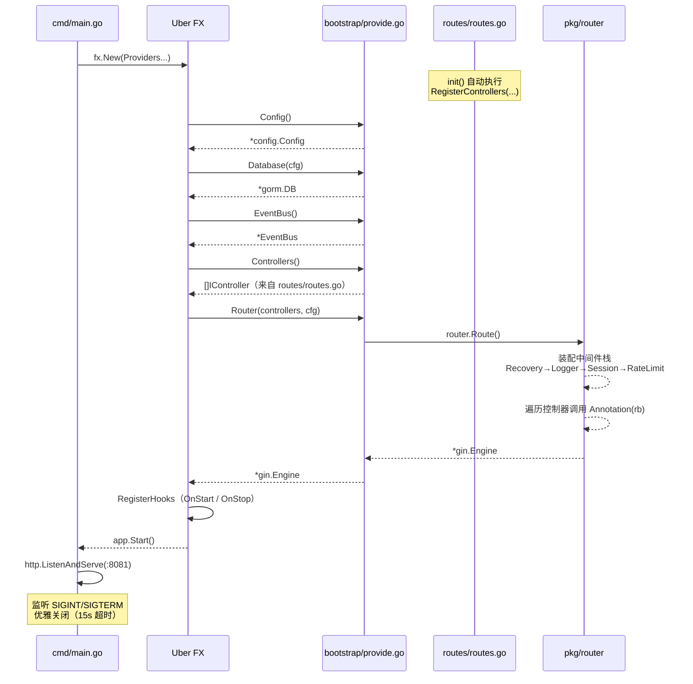
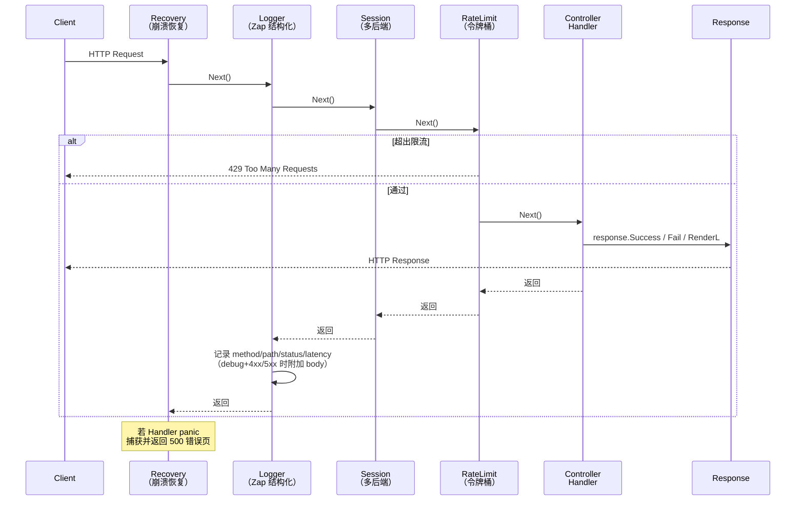
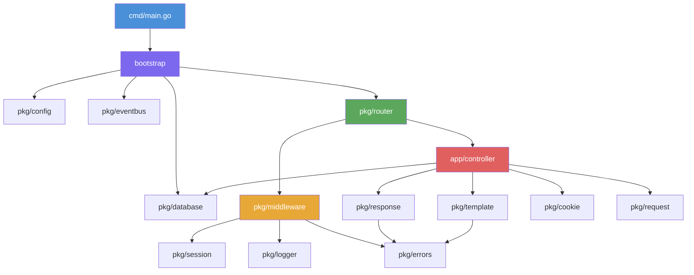

<div align="center">

# Go Framework

[](https://golang.org)
[](https://github.com/gin-gonic/gin)
[](LICENSE)
[](https://github.com/gorilla-go/go-framework/pulls)

**一个现代化、高性能的 Go Web 框架，基于 Gin 和 Uber FX 构建**

[特性](#-特性) • [架构](#-架构) • [快速开始](#-快速开始) • [文档](#-文档) • [项目结构](#-项目结构) • [贡献](#-贡献)

</div>

---

## ✨ 特性

### 🚀 核心能力

- **高性能路由** - 基于 [Gin](https://github.com/gin-gonic/gin) 框架，提供极速的 HTTP 请求处理
- **依赖注入** - 集成 [Uber FX](https://github.com/uber-go/fx)，实现自动依赖注入和生命周期管理
- **热重载开发** - 使用 [Air](https://github.com/air-verse/air) 支持代码热重载，无需手动重启
- **优雅启停** - 支持优雅关闭，确保请求正确处理完毕

### 🛠️ 开发体验

- **模块化设计** - 清晰的目录结构，易于维护和扩展
- **丰富中间件** - 内置日志、CORS、JWT、限流、会话等常用中间件
- **事件总线** - JavaScript 风格的事件系统，支持 on/once/off/emit
- **模板引擎** - 内置 100+ 实用模板函数，支持布局系统
- **配置管理** - 基于 Viper，支持 YAML 配置和环境变量覆盖
- **结构化日志** - 集成 Zap，支持日志分级、轮转和结构化输出

### 🔧 工具链

- **资源管道** - 集成 Gulp，支持 CSS/JS 压缩、打包和热重载
- **数据库 ORM** - 内置 GORM 支持，简化数据库操作
- **会话管理** - 支持 Cookie、Redis、GORM、Memory 四种存储方式
- **统一响应** - 标准化的 API 响应格式和错误处理
- **Cookie 操作** - 便捷的 Cookie 读写工具

---

## 🏗️ 架构

### 应用启动流程



### HTTP 请求处理流程



### 模块依赖关系



### 包结构

```
go-framework/
├── cmd/            # 入口：信号处理 + FX 启动
├── bootstrap/      # FX providers 注册
├── routes/         # 控制器注册（init 函数）
├── app/controller/ # 业务控制器
├── config/         # YAML 配置文件
├── templates/      # HTML 模板（布局系统）
├── static/         # 前端资源（src → Gulp → dist）
└── pkg/
    ├── router/     # 路由构建器 + 命名路由
    ├── middleware/ # Recovery, Logger, Session, RateLimit, CORS, JWT
    ├── template/   # 模板引擎 + 100+ 辅助函数
    ├── session/    # 多后端会话（Cookie/Redis/GORM/Memory）
    ├── eventbus/   # 线程安全事件总线
    ├── response/   # 统一 API 响应格式
    ├── errors/     # AppError 类型 + 开发错误页
    ├── database/   # GORM 初始化
    ├── logger/     # Zap 日志封装
    ├── config/     # Viper 配置加载
    ├── cookie/     # Cookie 读写工具
    └── request/    # 请求工具函数
```

---

## 📦 快速开始

### 环境要求

| 工具    | 版本要求 | 必需                    |
| ------- | -------- | ----------------------- |
| Go      | 1.24+    | ✅                      |
| Node.js | 14+      | ✅ (用于资源构建)       |
| MySQL   | 5.7+     | ⭕ (可选)               |
| Redis   | 任意版本 | ⭕ (可选，用于会话存储) |

### 安装

```bash
# 1. 克隆项目
git clone https://github.com/gorilla-go/go-framework.git
cd go-framework

# 2. 安装 Go 依赖
go mod tidy

# 3. 安装 Node.js 依赖（用于静态资源处理）
make install

# 4. 修改配置文件（数据库、Redis 等）
vi config/config.yaml
```

### 运行

```bash
# 开发模式（支持热重载，推荐）
make devs

# 生产模式
make build && make start
```

访问 http://localhost:8081 查看示例页面。

---

## 📖 文档

### 添加控制器

**第一步**：在 `app/controller/` 创建控制器文件：

```go
package controller

import (
    "github.com/gin-gonic/gin"
    "github.com/gorilla-go/go-framework/pkg/router"
    "github.com/gorilla-go/go-framework/pkg/response"
    "go.uber.org/fx"
)

type UserController struct {
    fx.In
    // 在此声明依赖，FX 自动注入
}

func (u *UserController) Annotation(rb *router.RouteBuilder) {
    g := rb.Group("/users")
    g.GET("", u.List, "user@list")
    g.GET("/:id", u.Show, "user@show")
}

func (u *UserController) List(c *gin.Context) {
    response.Success(c, gin.H{"users": []string{}})
}

func (u *UserController) Show(c *gin.Context) {
    response.Success(c, gin.H{"id": c.Param("id")})
}
```

**第二步**：在 `routes/routes.go` 注册：

```go
func init() {
    router.RegisterControllers(
        &controller.IndexController{},
        &controller.UserController{}, // 添加这行
    )
}
```

> **注意**：控制器在 `routes/routes.go` 的 `init()` 中注册，不是在 `bootstrap/provide.go`。

---

### 依赖注入

通过 `fx.In` 嵌入自动获取依赖：

```go
type ArticleController struct {
    fx.In
    DB     *gorm.DB
    Config *config.Config
    Bus    *eventbus.EventBus
}
```

如需注册新服务，在 `bootstrap/provide.go` 的 `Providers` 中添加：

```go
var Providers = []any{
    Config,
    EventBus,
    Database,
    Controllers,
    Router,
    NewArticleService, // 添加新服务
}
```

---

### 事件总线

JavaScript 风格的线程安全事件系统：

```go
// 订阅
eventbus.On("user.created", func(args ...interface{}) {
    user := args[0].(*User)
    fmt.Println("新用户:", user.Name)
})

// 一次性订阅
eventbus.Once("app.started", func(args ...interface{}) {
    fmt.Println("应用启动完成")
})

// 触发
eventbus.Emit("user.created", &User{Name: "Alice"})

// 取消订阅
eventbus.Off("user.created")
```

---

### 中间件

**全局中间件栈**（在 `pkg/router/router.go` 中按顺序装配）：

| 顺序 | 中间件 | 说明 |
|------|--------|------|
| 1 | Recovery | Panic 恢复，开发模式显示详细错误页 |
| 2 | Logger | Zap 结构化日志（method/path/ip/status/latency）|
| 3 | Session | 多后端会话初始化 |
| 4 | RateLimit | 令牌桶限流（可配置开关） |

**路由级中间件**（在控制器的 `Annotation` 方法中添加）：

```go
func (a *AuthController) Annotation(rb *router.RouteBuilder) {
    // 公开路由
    rb.POST("/login", a.Login, "auth@login")

    // 需要认证的路由组
    auth := rb.Group("/api")
    auth.Use(middleware.JWTMiddleware())
    auth.GET("/profile", a.Profile, "auth@profile")
}
```

---

### 会话管理

在 `config/config.yaml` 中配置后端：

```yaml
session:
  store: cookie    # cookie | redis | gorm | memory
  name: go_session
  secret: "your-secret-key"
  max_age: 60      # 分钟
```

API：

```go
session.Set(c, "user_id", 123)
session.Get(c, "user_id")           // 返回 interface{}
session.GetValue[int](c, "user_id") // 泛型版本，返回 int
session.Delete(c, "user_id")
session.Clear(c)

// Flash 消息（读取后自动删除）
session.SetFlash(c, "success", "操作成功")
session.GetFlash(c, "success")
```

---

### 统一响应

```go
// 成功响应
response.Success(c, gin.H{"id": 1, "name": "Alice"})
// → {"code": 200, "data": {"id": 1, "name": "Alice"}}

// 带消息的成功响应
response.SuccessD(c, "创建成功", user)

// 错误响应
response.Fail(c, errors.NewNotFound("用户不存在", nil))
// → HTTP 404, {"code": 404, "message": "资源不存在", "data": "用户不存在"}

// 重定向
response.Redirect(c, "/login")
response.Redirect(c, "/new-url", 301)
```

---

### 模板渲染

```go
// 使用默认布局渲染（推荐）
template.RenderL(c.Writer, "index", gin.H{
    "Title": "首页",
    "User":  user,
})

// 指定布局
template.Render(c.Writer, "admin/dashboard", data, "admin")

// 不使用布局
template.Render(c.Writer, "email/welcome", data)
```

模板文件结构：
```
templates/
├── layouts/
│   └── main.html      # 默认布局，定义 {{block "content" .}}
├── index.html         # {{define "content"}} ... {{end}}
└── users/
    └── list.html
```

---

### Cookie

```go
// 写入
cookie.Set(c, "token", "abc123")
cookie.SetWithDuration(c, "remember", "yes", 7*24*time.Hour)

// 读取
val := cookie.Get(c, "token")
val, ok := cookie.GetWithDefault(c, "token", "default")

// 删除
cookie.Delete(c, "token")
```

---

### JWT 认证

```go
// 生成 Token
token, err := middleware.GenerateToken(userID, username, role, 24)

// 路由保护
auth := rb.Group("/api")
auth.Use(middleware.JWTMiddleware())
auth.Use(middleware.RoleMiddleware("admin")) // 可选角色校验

// 获取当前用户
claims, _ := middleware.GetClaimsFromContext(c)
userID, _ := middleware.GetUserIDFromContext(c)
```

---

### 命名路由 URL 生成

```go
// 在控制器中定义带名称的路由
rb.GET("/users/:id", u.Show, "user@show")

// 生成 URL（在 Go 代码中）
url, err := router.BuildUrl("user@show", map[string]any{"id": 42})
// → "/users/42", nil

// 在模板中使用
// <a href="{{ route "user@show" (map "id" .User.ID) }}">查看用户</a>
```

---

### 配置说明

`config/config.yaml` 支持环境变量覆盖（`.` 替换为 `_`）：

```yaml
server:
  port: 8081
  mode: debug          # debug | release
  enable_rate_limit: true
  rate_limit: 100      # 每秒请求数
  rate_burst: 200      # 突发容量

database:
  driver: mysql
  host: localhost
  port: 3306
  username: root
  password: password
  dbname: go_framework

session:
  store: cookie        # cookie | redis | gorm | memory
  secret: "secret-key"
  max_age: 60

log:
  level: info
  format: json         # json | console
  output: logs/app.log
```

环境变量覆盖示例：

```bash
export SERVER_PORT=8080
export DATABASE_HOST=192.168.1.100
export SERVER_MODE=release
```

---

## 🗂️ 项目结构

```
go-framework/
├── cmd/
│   └── main.go              # 入口：FX 启动 + 信号处理
├── bootstrap/
│   ├── app.go               # FX 生命周期 hooks + HTTP Server
│   └── provide.go           # 依赖提供者注册
├── routes/
│   └── routes.go            # 控制器注册（init 函数）
├── app/
│   └── controller/          # 业务控制器
├── config/
│   └── config.yaml          # 应用配置
├── templates/
│   ├── layouts/main.html    # 默认布局
│   └── index.html           # 首页模板
├── static/
│   ├── src/                 # 前端源文件（编辑此处）
│   ├── dist/                # 构建产物（自动生成，勿手动修改）
│   └── gulpfile.js          # Gulp 构建配置
├── pkg/
│   ├── router/              # 路由构建器、命名路由、IController 接口
│   ├── middleware/          # Recovery, Logger, Session, RateLimit, CORS, JWT
│   ├── template/            # 模板引擎管理器 + FuncMap（100+ 函数）
│   ├── session/             # 多后端会话（Cookie/Redis/GORM/Memory）
│   ├── eventbus/            # 线程安全事件总线
│   ├── response/            # 统一 API 响应
│   ├── errors/              # AppError + 开发错误页渲染
│   ├── database/            # GORM 初始化（MySQL/SQLite）
│   ├── logger/              # Zap 封装
│   ├── config/              # Viper 配置加载
│   ├── cookie/              # Cookie 工具
│   └── request/             # 请求工具（IsAjax/GetClientIP 等）
├── scripts/
│   ├── get-port.sh          # 读取配置端口（供 Makefile 使用）
│   └── cleanup.sh           # 清理孤儿进程和临时文件
├── .air.toml                # Air 热重载配置
├── Makefile                 # 常用命令
└── go.mod
```

---

## 🧪 测试

```bash
# 运行全部测试
go test ./...

# 运行指定包的详细测试
go test ./pkg/eventbus/... -v

# 运行性能基准测试
go test -bench=. ./pkg/eventbus/...

# 并发安全检测
go test -race ./pkg/eventbus/...
```

---

## 🚀 常用命令

```bash
make devs        # 清理并启动开发环境（推荐）
make dev         # 启动开发服务器（Air 热重载）
make build       # 构建生产二进制
make start       # 前台启动生产服务
make startd      # 后台启动生产服务
make stop        # 停止后台服务
make install     # 安装 Node.js 依赖
make gulp-build  # 构建静态资源
make clean       # 清理临时文件和孤儿进程
```

---

## 🐳 部署

### Docker

```bash
docker build -t go-framework:latest .
docker run -d -p 8081:8081 \
  -v $(pwd)/config:/app/config \
  --name go-framework \
  go-framework:latest
```

### 二进制部署

```bash
make build    # 生成 ./main（含 -ldflags="-s -w" 体积优化）
make startd   # 后台运行，PID 写入 .pid
make stop     # 通过 SIGTERM 优雅停止
```

---

## 🤝 贡献

1. Fork 本仓库
2. 创建特性分支：`git checkout -b feat/your-feature`
3. 提交更改：`git commit -m 'feat: add your feature'`
4. 推送分支：`git push origin feat/your-feature`
5. 提交 Pull Request

**代码规范**：
- 遵循 Go 官方代码风格
- 新功能需附带测试
- 提交信息使用 [Conventional Commits](https://www.conventionalcommits.org/)

---

## 📄 License

MIT License - 详见 [LICENSE](LICENSE) 文件
